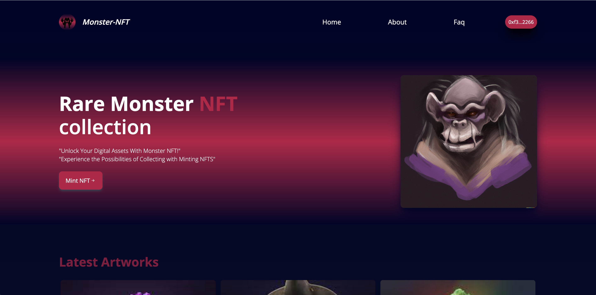

## This is an example of an basic docker setup for a Web3 project



<center><figcaption>Dockerized Web3 Project Example</figcaption></center>
## Technology

This demo uses:

- ReactJs
- NodeJs
- MySQL
- PHPMyAdmin
- Tailwind CSS
- Solidity
- EthersJs
- Hardhat
- Docker

## Running the demo

To run the demo follow these steps:

1. Clone the project with the code below.

   ```sh
   git clone https://github.com/Daltonic/dockerized_web3_project_example dockerized_web3_project
   ```

2. In the root and of the backend directories, create a `.env` files and paste the codes below in it.
3. Update the `.env` file with the following details.
   ```sh
   MYSQL_DATABASE=<Your Database Name Here>
   MYSQL_USER=<Your User Name Here>
   MYSQL_PASSWORD=<Your Password Name Here>
   MYSQL_ROOT_PASSWORD=<Your Root/Admin Password Name Here>
   ```
4. Run `docker-compose up` to launch the services.

5. Run `docker-compose down` to end the services.

6. Visit **http://localhost:8080/** and import the `monsternft.sql` file into your `monsternft` database.
   <br/>
7. Interact with the frontend from **http://localhost:3000/** and the backend at **http://localhost:9000/**.

Questions about running the demo? [Open an issue](https://github.com/Daltonic/dockerized_web3_project_example/issues). We're here to help ✌️

## Useful links

- 🏠 [Website](https://daltonic.github.io/)
- ✨ [NodeJs](https://hub.docker.com/_/node)
- ⚽ [MySQL](https://hub.docker.com/_/mysql/)
- 🚀 [PHPMyAdmin](https://hub.docker.com/_/phpmyadmin/)
- 💡 [Hardhat](https://hardhat.org/)
- 🔥 [ReactJs](https://reactjs.org/)
- 🐻 [Solidity](https://soliditylang.org/)
- 👀 [Ethersjs](https://docs.ethers.io/v5/)